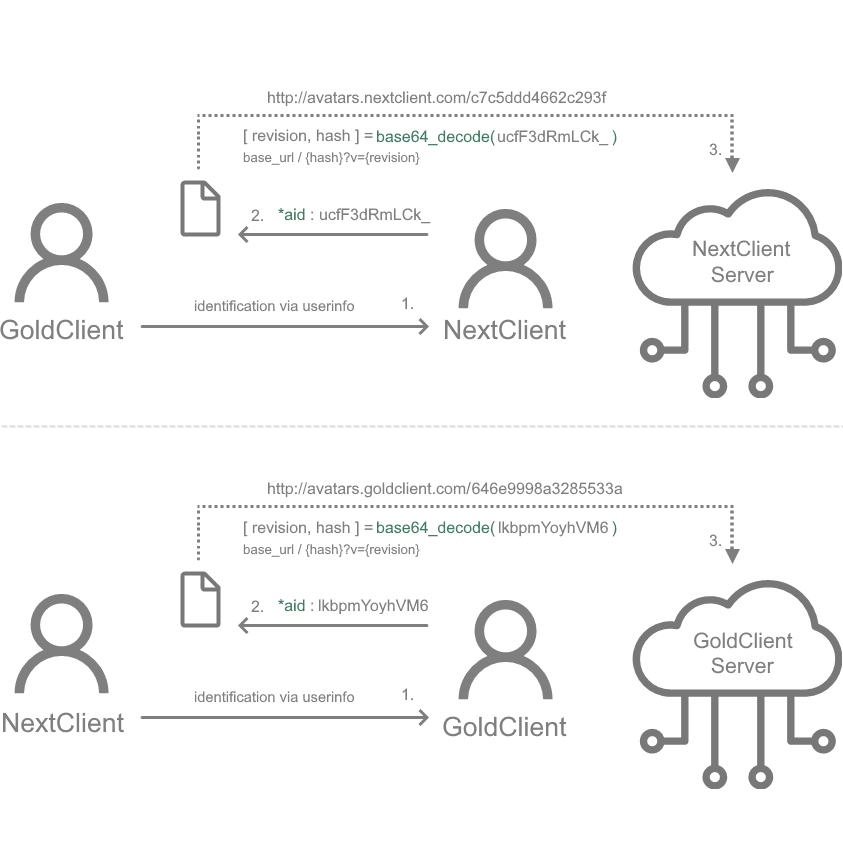

🌐 Available languages:  [Русский](README.ru.md) |  [English](README.md)

# GoldSrc Avatar Hub Protocol Concept
> ⚠️ This is currently a conceptual specification. The system is not yet implemented by any client. URL templates for provider hubs are to be defined (TBD). As implementations progress, this document will be updated to reflect working standards.

## Annotation

This repository outlines the conceptual specification for a **decentralized, federated avatar system** for GoldSrc engine clients (such as Counter-Strike 1.6). \
The goal of this protocol is to provide a unified, efficient, and scalable method for different client modifications ( e.g., [GoldClient](https://gold-plus.github.io/en/), [NextClient](https://github.com/CS-NextClient/NextClient) ) to share and display custom player avatars without relying on a single, centralized server, thus preventing bottlenecks and single points of failure inherent in legacy systems.

The core principle is **client-side identification and direct, immutable avatar fetching**. \
Avatars can be served from standard web servers, and providers may optionally use CDN or reverse proxies to improve performance, caching, and scalability if needed.

---

## Table of Contents

- [What is `*aid`?](#what-is-aid)
- [Why decentralized?](#why-decentralized)
- [How it works](#how-it-works-protocol-flow)
- [Notes for server owners](#notes-for-server-owners)
- [Security Considerations](#security-considerations)
- [For Developers Wishing to Integrate](#for-devs)
- [Provider status](#provider-status)
- [Key Takeaways / Summary](#summary)

---

## What is `*aid`?

**AvatarID (`*aid`)** is a standardized, compact, and unique id within a provider for avatar used in GoldSrc-based clients ( e.g., [GoldClient](https://gold-plus.github.io/en/), [NextClient](https://github.com/CS-NextClient/NextClient) ). \
It is intended to be transmitted via the player's `userinfo` string, enabling clients to share avatar identifiers across different, independent clients.

An `*aid` consists of two parts: \
`[Provider Prefix (1 char)]` + `Encoded block [Revision (1 byte) + Unique User Hash (8 bytes)]`

1. **Provider Prefix**
   * **Purpose:**
     To identify which mod community (**provider**) the user belongs to. \
     This allows clients to look up the correct URL Hub for fetching the avatar.
   * **Format:** A single, case-sensitive ASCII character.
   * **Examples:**
     * `G` : GoldClient
     * `N` : NextClient
     * `X` : SomeFuture Client

2. **Encoded Revision & Unique User Hash**
   * **Purpose:**
     This part combines two crucial pieces of information: a revision counter to track avatar changes and a persistent user identifier.

   * **Generation Algorithm:**
     * Step 1. A **1-byte Revision counter** (0-255) is generated. \
       This counter should increment each time the user uploads a new avatar **to its own provider's hub**.
     * Step 2. A **persistent, deterministic 8-byte (64-bit) Unique User Hash** is generated from a stable, hardware-based identifier (e.g., a SHA-256 hash of the primary hard drive's serial number).
     * Step 3. These two parts (`1-byte Revision` + `8-byte Hash`) are concatenated to form a **9-byte binary block**.
     * Step 4. This 9-byte block is encoded into a **12-character string** using Base64 (`RFC 4648`).
       * See [encode_aid.cpp](cpp/examples/encode_aid.cpp) for a minimal working encoding/decoding example.

   * Example `*aid`
     * `*aid : GlkbpmYoyhVM6`
     * `G` → provider prefix (GoldClient)
     * `lkbpmYoyhVM6` → Base64-encoded 9-byte binary block **[Revision (1 byte) + Unique User Hash (8 bytes)]**
       * Step 1. Decode from Base64 → 9 raw bytes: `0x96 0x46 0xe9 0x99 0x8a 0x32 0x85 0x53 0x3a`
       * Step 2. Split the bytes:
         * First byte → `0x96` → **Revision 150**
         * Next 8 bytes → `0x46 ... 0x3a` → **Unique User Hash**
       * Step 3. Convert unique user hash bytes to lowercase hexadecimal string → `46e9998a3285533a`
       * Result → Decoded unique user hash image for GoldClient avatar hub

---

## Why decentralized?

In the past, avatar systems often depended on a **centralized API or server**. \
This approach introduces several risks:
 - **Bus factor problem** — one admin becomes the single point of failure.
 - **Downtime risk** — if the central server is offline, the entire system breaks.
 - **Scalability limits** — the ecosystem depends on one maintainer or infrastructure.

**AvatarID avoids these issues:**
  - Each mod maintains its own **avatar hub** (web storage for uploaded avatars).
  - Clients exchange only `*aid` strings via `userinfo`.
  - A client can resolve an avatar URL using local provider configuration (prefix → URL template).

This ensures resilience, independence, and long-term sustainability.

---

## How It Works: Protocol Flow



1. **Avatar Selection & Upload:**
    * A player selects a new avatar in their client (e.g., GoldClient, NextClient).
    * The client **increments its local, persistent revision counter** (e.g., from `149` to `150`).
    * The client then constructs the **new** `*aid` string using the **new revision number**.
    * The client uploads the avatar **only to its own provider's hub** (typically via a POST request), with filename **Unique User Hash**. \
      In the hub URL, the decoded **user hash** part of the `*aid`, represented as a lowercase hex string (excluding the provider prefix) is used as the filename **without extension**, e.g.: \
      `https://avatars.goldclient.com/{decoded_hash}` \
      The actual file format is negotiated later using HTTP `Accept` headers.
    * Upon successful upload, the client begins broadcasting the new `*aid` (with the incremented revision) in its `userinfo`.

2. **Client-Side Identification & Configuration Lookup:**
    * When *Client A* observes another player (*Client B*), it reads *Client B's* `userinfo` to find the `*aid` key.
    * The *Client A* extracts the provider prefix (first character) and maps it to the corresponding provider info from its preloaded local configuration, which contains URLs and metadata. \
      Example config:

    ```json
    "services": {
      "avatar": {
        "providers": {
          "G": { "url": "http://avatars.goldclient.com/" },
          "N": { "url": "http://avatars.nextclient.com/" },
          "S": { "url": "https://steamcommunity.com/profiles/{*sid}?xml=1" },
          "X": { "url": "TBD" }
        }
      }
    }
    ```

    * Config updates are handled by the client: bundled with the mod, downloaded via an update server, or stored locally.

3. **Fetching the Avatar:**
    * *Client A* constructs the immutable avatar URL by substituting the unique user hash into the provider's URL template (note: **no extension is appended**):

      ```
      <Provider Base URL> + <Decoded Unique User Hash, represented as a lowercase hex string>
      ```

      Example (revision = 0, no query parameter): \
      `http://avatars.goldclient.com/46e9998a3285533a`
      <br/><br/>

      If the revision counter is greater than zero, it is appended as a cache-busting query parameter:

      ```
      <Provider Base URL> + <Decoded Unique User Hash> + "?v=" + <Revision>
      ```

      Example (revision = 150): \
      `http://avatars.goldclient.com/46e9998a3285533a?v=150` \
      This design ensures that the avatar file itself remains immutable, while the revision acts as a lightweight cache-buster across clients and CDNs.
      <br/><br/>

    * *Client A* includes HTTP headers to declare capabilities:
        - `Accept` — which image formats it supports, e.g.:
          ```
          Accept: image/png;q=1.0, image/jpeg;q=0.8, image/webp;q=0.7
          ```
          Providers will serve the avatar in the best matching format. \
          By default, providers MUST respond `image/jpeg` for maximum compatibility.

        - `User-Agent` — identifies the client type and version. \
           It serves as standard HTTP identification and allows providers to differentiate requests by client type if needed:
          ```
            User-Agent: GoldClient/2.5.6.0
          ```

    * The avatar is fetched directly from the provider hub; no central server coordination is needed.

---

## ⚠️ <a id="notes-for-server-owners"></a>Important Note for Server Administrators (ReHLDS) ##

This protocol relies on clients being able to share their `*aid` key via `userinfo`. \
If you have customized the `sv_rehlds_userinfo_transmitted_fields` cvar to optimize traffic, you **MUST** include the `*aid` key in the CVar.

- ✔️ **Default behavior (empty value):** all fields, including `*aid`, are transmitted.

- **Restricted configuration example:** \
  ❌ In this case, `*aid` will **not** be shared :
  ```bash
  sv_rehlds_userinfo_transmitted_fields "\name\model\*sid"
  ```
  ✔️ To enable AvatarID support, add `*aid` :
  ```bash
  sv_rehlds_userinfo_transmitted_fields "\name\model\*sid\*aid"
  ```

---

## Security Considerations

* The `*aid` is strictly an **avatar identifier** and **must not** be used for authentication or authorization purposes.
* Do not assume uniqueness guarantees beyond the scope of the federated avatar system.
* Treat `*aid` values as **public information**; they can be observed and spoofed by any client on the server.

---

## <a id="for-devs"></a>For Developers Wishing to Integrate ##

This protocol is open for any GoldSrc modding project. \
To join the federated hub:

1. **Choose a unique Provider Prefix** for your project. \
   Please check with existing projects to avoid collisions.

2. **Implement the `*aid` generation logic** on your client, based on a revision counter and deterministic hardware hash.
   * **Implement the Revision Counter.** The 1-byte revision counter is crucial for cache invalidation on other clients.
   * **Minimum Requirement:** The counter MUST increment within a single game session whenever a user uploads a new avatar.
   * **Best Practice (Recommended):** For the best user experience, it is **highly recommended** to make this counter **persistent**. \
     The counter should be saved locally on the user's machine (e.g., in a config file or the registry) so that it survives game restarts. \
     This ensures that avatar changes are correctly propagated to other players even between sessions.

3. **Implement a robust client-side caching strategy.** \
   To prevent unnecessary network traffic and reduce load on provider hubs, client **MUST** implement a local caching mechanism.
   * **In-Session Caching (Minimum Requirement):** \
     An avatar, once fetched, **MUST** be cached for the entire duration of a player's connection to a current server, including reconnects. \
     Do not re-fetch the same avatar (`revision` + `user hash`) multiple times on the same server.
   * **Orphan Avatar Lifetime (Best Practice):** \
     When a player leaves the server, their avatar **SHOULD NOT** be deleted from the cache immediately. \
     It is **highly recommended** to implement an "orphan" lifetime (e.g., 5 minutes). \
     This prevents re-fetching the avatar if the player quickly reconnects. \
     The avatar can be safely purged from memory after this grace period expires.

4. **Set up a hosting backend** for storing and serving avatars. \
   Avatar images should be named after the **decoded Unique User Hash** from the `*aid`, represented as a lowercase hex string. (e.g `46e9998a3285533a`) \
   *Using a CDN is optional for performance, but not required.*

5. **Use a dedicated subdomain for federated avatar sharing**. \
   This ensures that the shared avatars between clients are isolated from your main infrastructure, allowing you to maintain control and optionally opt out of sharing in the future.

6. **Add your project's information to the participants list**. \
   You can either contact existing hub members (like GoldClient, NextClient) to have your Provider Prefix and avatar hub URL added to their configuration manifests, \
   or submit a Pull Request to this repository by updating/adding in [provider status](#provider-status).

This collaborative approach allows all participating communities to benefit from a shared, robust avatar system while maintaining full control over their own infrastructure.

---

## Provider status

- `G` → GoldClient  (URL template <code style="color:dimgray">*TBD*</code>)
- `N` → NextClient  (URL template <code style="color:dimgray">*TBD*</code>)
- `S` → SteamClient (URL template `https://steamcommunity.com/profiles/{*sid}?xml=1`)
- More providers may join by defining their prefix and hub rules.

---

## <a id="summary"></a>Key Takeaways / Summary ##

- `*aid` is a compact, deterministic avatar identifier unique **within a provider**.
- Clients resolve avatars independently using local configuration (provider prefix → URL template).
- No single, centralized server is required; each mod maintains its own avatar hub.
- The system supports multiple providers, allowing cross-client avatar sharing.
- Configurable `userinfo` fields (`*aid`) must be transmitted for correct sharing.
- Avatar hashes are encoded using standard Base64 (`RFC 4648, Section 4, standard alphabet`), ensuring interoperability and avoiding custom alphabet pitfalls.
