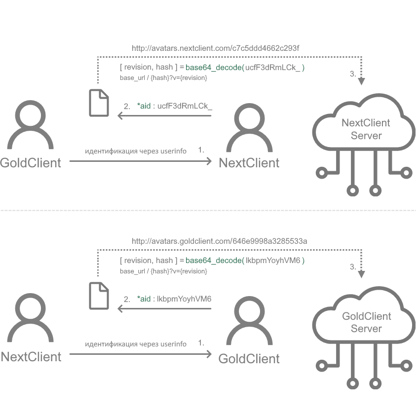

🌐 Доступные языки:  [Русский](README.ru.md) |  [English](README.md)

# Концепция протокола GoldSrc Avatar Hub
> ⚠️ Это концептуальная спецификация. Система пока не реализована ни в одном клиенте. Шаблоны URL-адресов для хабов провайдеров ещё предстоит определить (TBD). По мере развития реализаций этот документ будет обновляться и уточняться.

## Введение

Этот репозиторий описывает концептуальную спецификацию **децентрализованной федеративной системы аватаров** для клиентов на движке GoldSrc (например, Counter-Strike 1.6). \
Цель протокола — обеспечить единый, эффективный и масштабируемый способ для различных клиентских модификаций ( например, [GoldClient](https://gold-plus.github.io/), [NextClient](https://github.com/CS-NextClient/NextClient) ) делиться и отображать пользовательские аватары без единого централизованного сервера, тем самым устраняя узкие места и риски отказа, характерные для старых систем.

Ключевой принцип — **идентификация на стороне клиента и прямое, неизменяемое получение аватаров**. \
Аватары могут храниться и раздаваться с обычных веб-серверов, а провайдеры при желании могут использовать CDN или обратные прокси для ускорения работы, кэширования и масштабируемости.

---

## Содержимое

- [Что такое `*aid`?](#что-такое-aid)
- [Зачем децентрализация?](#зачем-децентрализация)
- [Как это работает](#как-это-работает)
- [Заметки для админов серверов](#примечания-для-администраторов-серверов)
- [Вопросы безопасности](#вопросы-безопасности)
- [Для разработчиков](#для-разработчиков)
- [Статус провайдеров](#статус-провайдеров)
- [Итоги](#итоги)

---

## Что такое `*aid`?

**AvatarID (`*aid`)** — это стандартизированный, компактный и уникальный идентификатор аватара внутри провайдера, используемый в клиентах на движке GoldSrc ( например, [GoldClient](https://gold-plus.github.io/en/), [NextClient](https://github.com/CS-NextClient/NextClient) ). \
Он передаётся через строку `userinfo` игрока и позволяет разным независимым клиентам обмениваться идентификаторами аватаров.

`*aid` состоит из двух частей: \
`[Префикс провайдера (1 символ)]` + `Закодированный блок [Счетчик ревизии (1 байт) + Уникальный хэш пользователя (8 байтов)]`

1. **Префикс провайдера**
   * **Назначение:**
     Определяет, к какому сообществу (провайдеру) относится пользователь. \
     Это позволяет клиентам найти правильный URL хаба для получения аватара.
   * **Формат:** Один символ ASCII (чувствительный к регистру).
   * **Примеры:**
     * `G` : GoldClient
     * `N` : NextClient
     * `X` : Другой клиент

2. **Закодированный блок: Ревизия и Уникальный хэш пользователя**
   * **Назначение:**
     Эта часть объединяет две критически важные единицы информации: счетчик ревизии для отслеживания изменений аватарки и постоянный идентификатор пользователя.

   * **Алгоритм генерации:**
     * Шаг 1. Генерируется **1-байтовый счетчик Ревизии** (0-255). \
       Этот счетчик ревизии должен увеличиваться каждый раз, когда пользователь загружает новую аватарку **в хаб своего провайдера**.
     * Шаг 2. Генерируется **постоянный, детерминированный 8-байтовый (64-битный) Уникальный хэш пользователя** из стабильного аппаратного идентификатора (например, SHA-256 хэш от серийного номера жесткого диска).
     * Шаг 3. Эти две части (`1-байт Ревизии` + `8-байт Хэша`) объединяются в **9-байтовый бинарный блок**.
     * Шаг 4. Этот 9-байтовый блок кодируется в **12-символьную строку** с помощью Base64 (`RFC 4648`).
       * См. [encode_aid.cpp](cpp/examples/encode_aid.cpp) для минимального примера кодирования/декодирования.

   * Пример `*aid`
     * `*aid : GlkbpmYoyhVM6`
     * `G` → префикс провайдера (GoldClient)
     * `lkbpmYoyhVM6` → Закодированный 9-байтовый бинарный блок Base64 **[Счетчик ревизии (1 байт) + Уникальный хэш пользователя (8 байтов)]**
       * Шаг 1. Декодировать из Base64 → 9 байт: `0x96 0x46 0xe9 0x99 0x8a 0x32 0x85 0x53 0x3a`
       * Шаг 2. Разделить байты:
         * Первый байт → `0x96` → **Ревизия 150**
         * Следующие 8 байтов → `0x46 ... 0x3a` → **Уникальный хэш пользователя**
       * Шаг 3. Переводим байты в строку в нижнем регистре в hex → `46e9998a3285533a`
       * Итог → Уникальный хэш пользователя для GoldClient для последующего использования в хабе провайдера

---

## Зачем децентрализация?

Раньше системы аватаров опирались на **централизованный API или сервер**.
Это влечёт за собой риски:
 - **Фактор автобуса** — один админ становится точкой отказа.
 - **Риск простоя** — если сервер упал, система ломается полностью.
 - **Ограничения масштабируемости** — всё завязано на одного человека или инфраструктуру.

**AvatarID решает эти проблемы:**
  - Каждый мод поддерживает свой **аватар-хаб** (хранилище для аватаров).
  - Клиенты обмениваются только строками `*aid` через `userinfo`.
  - Клиент может получить URL аватара из локальной конфигурации (префикс → шаблон URL).

Это даёт устойчивость, независимость и долговечность.

---

## <a id="как-это-работает"></a>Как это работает: Схема протокола ##



1. **Выбор и загрузка аватарки:**
    * Игрок выбирает аватарку в своём клиенте (например, GoldClient, NextClient).
    * Клиент **увеличивает свой локальный счетчик ревизии** (например, с `149` до `150`).
    * Затем клиент конструирует **новый** `*aid`, используя **новый счетчик ревизии**.
    * Клиент загружает аватарку **только в хаб своего провайдера**, используя в качестве имени файла **Уникальный хэш пользователя**. \
      В URL хаба декодированная часть **хэша** из `*aid` (представленная как hex-строка) используется как имя файла **без расширения**, например: \
      `https://avatars.goldclient.com/{decoded_hash}` \
      Формат файла выбирается позже через заголовок HTTP `Accept`.
    * **После успешной загрузки**, клиент начинает передавать новый `*aid` (с увеличенной ревизией) в своем `userinfo`.

2. **Идентификация на стороне клиента и поиск в конфигурации:**
    * Когда *Клиент А* видит другого игрока (*Клиент Б*), он читает `userinfo` *Клиента Б*, чтобы найти ключ `*aid`.
    * *Клиент А* извлекает префикс провайдера (первый символ) и сопоставляет его с информацией о соответствующем провайдере из своей предварительно загруженной локальной конфигурации, которая содержит URL и метаданные. \
      Пример конфигурации:

    ```json
    "services": {
      "avatar": {
        "providers": {
          "G": { "url": "http://avatars.goldclient.com/" },
          "N": { "url": "http://avatars.nextclient.com/" },
          "S": { "url": "https://steamcommunity.com/profiles/{*sid}?xml=1" },
          "X": { "url": "TBD" }
        }
      }
    }
    ```

    * Обновление конфигурации обрабатывается клиентом: поставляется вместе с модом, загружается через сервер обновлений или хранится локально.

3. **Получение аватарки:**
    * *Клиент A* формирует неизменяемый URL аватара, подставляя уникальный хэш пользователя в шаблон URL провайдера (примечание: **расширение не добавляется**):

      ```
      <Базовый URL провайдера> + <Декодированный уникальный хэш пользователя, представленный в виде строки в нижнем регистре в формате hex>
      ```

      Пример (ревизия = 0, без query-параметра): \
      `http://avatars.goldclient.com/46e9998a3285533a`
      <br/><br/>

      Если счетчик ревизии больше нуля, он добавляется как query-параметр для обхода кэша:

      ```
      <Provider Base URL> + <Декодированный уникальный хэш пользователя> + "?v=" + <Ревизия>
      ```

      Пример (ревизия = 150): \
      `http://avatars.goldclient.com/46e9998a3285533a?v=150` \
      Такой подход гарантирует, что сам файл аватара остаётся неизменным, а ревизия выступает лёгким "кэш-бастером" для клиентов и CDN.
      <br/><br/>

    * *Клиент A* ДОЛЖЕН включать в HTTP заголовки:
        - `Accept` — какие форматы изображений поддерживаются, например:
          ```
          Accept: image/png;q=1.0, image/jpeg;q=0.8, image/webp;q=0.7
          ```
          Провайдеры будут отдавать аватарку в наиболее подходящем формате. \
          По умолчанию провайдеры ДОЛЖНЫ отвечать `image/jpeg` для максимальной совместимости.

        - `User-Agent` — определяет тип и версию клиента. \
           Это служит стандартной идентификацией HTTP и позволяет хабам аватарок различать запросы по типу клиента при необходимости:
          ```
            User-Agent: GoldClient/2.5.6.0
          ```

    * Аватар загружается напрямую с хаба провайдера; координация через центральный сервер не требуется.

---

## ⚠️ <a id="примечания-для-администраторов-серверов"></a>Важное примечание для администраторов серверов (ReHLDS) ##

Этот протокол зависит от возможности клиентов обмениваться ключом `*aid` через `userinfo`. \
Если вы изменили квар `sv_rehlds_userinfo_transmitted_fields` для оптимизации трафика, вы **ДОЛЖНЫ** включить ключ `*aid` в этот квар.

- ✔️ **Поведение по умолчанию (пустое значение):** передаются все поля, включая `*aid`.

- **Пример ограниченной конфигурации:** \
  ❌ В этом случае `*aid` **не будет** передаваться:
  ```bash
  sv_rehlds_userinfo_transmitted_fields "\name\model\*sid"
  ```
  ✔️ Чтобы включить поддержку AvatarID, добавьте `*aid`:
  ```bash
  sv_rehlds_userinfo_transmitted_fields "\name\model\*sid\*aid"
  ```

---

## Вопросы безопасности

* `*aid` — это исключительно **идентификатор аватарки** и **не должен** использоваться для аутентификации или авторизации.
* Не следует полагаться на гарантии уникальности за пределами системы аватарок.
* Считайте значения `*aid` **публичной информацией**; они могут быть перехвачены и подделаны любым клиентом на сервере.

---

## <a id="для-разработчиков"></a>Для разработчиков, желающих интегрироваться ##

Этот протокол открыт для любого проекта по моддингу GoldSrc. \
Чтобы присоединиться к федеративному хабу:

1. **Выберите уникальный Префикс Провайдера** для вашего проекта. \
   Пожалуйста, сверьтесь с существующими проектами, чтобы избежать коллизий.

2. **Реализуйте логику генерации `*aid`** в вашем клиенте, основанную на счетчике ревизии и детерминированном хэше "железа".
   * **Реализуйте счетчик ревизий.** 1-байтовый счетчик ревизий важен для инвалидации кэша у других клиентов.
   * **Минимальное требование:** Счетчик ДОЛЖЕН увеличиваться в рамках одной игровой сессии каждый раз, когда пользователь загружает новую аватарку.
   * **Лучшая практика (Рекомендуется):** Для наилучшего пользовательского опыта **настоятельно рекомендуется** сделать этот счетчик **персистентным**. \
     Счетчик должен сохраняться локально на машине пользователя (например, в файле конфигурации или реестре), чтобы он переживал перезапуски игры. \
     Это гарантирует, что изменения аватарок будут корректно распространены между игроками даже между игровыми сессиями.

3. **Реализуйте надежную стратегию кэширования на стороне клиента.** \
   Чтобы предотвратить избыточный сетевой трафик и снизить нагрузку на хабы провайдеров, клиент **ОБЯЗАН** реализовывать локальный механизм кэширования.
   * **Кэширование в рамках сессии (Минимальное требование):** \
     Загруженная аватарка **ДОЛЖНА** кэшироваться на всё время подключения игрока к **текущему** серверу, включая переподключения. \
     Не следует повторно запрашивать одну и ту же аватарку (`ревизия` + `хэш пользователя`) несколько раз на одном и том же сервере.
   * **Время жизни "осиротевших" аватарок (Лучшая практика):** \
     Когда игрок покидает сервер, его аватарка **НЕ ДОЛЖНА** удаляться из кэша немедленно. \
     **Настоятельно рекомендуется** реализовать время жизни для "осиротевших" аватарок (например, 5 минут). \
     Это предотвратит повторную загрузку аватарки, если игрок постоянно делает переподключение. \
     Аватарку можно безопасно удалить из памяти по истечении этого льготного периода.

4. **Настройте бэкенд для хостинга** и раздачи аватарок. \
   Файлы изображений аватарок должны быть названы в соответствии с **декодированным уникальным хэшем** из `*aid`, представленным в виде строки в нижнем регистре в формате hex. (например `46e9998a3285533a`) \
   *Использование CDN является опциональным для производительности, но не обязательным.*

5. **Используйте выделенный поддомен для федеративного обмена аватарками.** \
   Это гарантирует, что общие аватарки между клиентами будут изолированы от вашей основной инфраструктуры, позволяя вам сохранять контроль и при необходимости в будущем отказаться от участия в обмене.

6. **Добавьте информацию о своём моде в список участников**. \
   Вы можете либо связаться с существующими участниками хаба (такими как GoldClient, NextClient), чтобы ваш Префикс Провайдера и URL хаба аватарок были добавлены в их конфигурацию, \
   либо отправить Pull Request в этот репозиторий, обновив/добавив свои данные в [статус провайдеров](#статус-провайдеров).

Такой совместный подход позволяет всем участвующим сообществам извлечь выгоду из общей, надежной системы аватарок, сохраняя при этом полный контроль над своей собственной инфраструктурой.

---

## <a id="статус-провайдеров"></a>Статус провайдеров ##

- `G` → GoldClient  (шаблон URL <code style="color:dimgray">*TBD*</code>)
- `N` → NextClient  (шаблон URL <code style="color:dimgray">*TBD*</code>)
- `S` → SteamClient (шаблон URL `https://steamcommunity.com/profiles/{steamid64}?xml=1`)
- Другие провайдеры могут присоединиться, определив свой префикс и правила хаба.

---

## <a id="Итоги"></a>Ключевые моменты / Итог ##

- `*aid` — это компактный, детерминированный идентификатор аватарки, уникальный **в рамках одного провайдера**.
- Клиенты определяют URL аватарок независимо, используя локальную конфигурацию (префикс провайдера → шаблон URL).
- Единый, централизованный сервер не требуется; каждая модификация поддерживает свой собственный хаб аватарок.
- Система поддерживает множество провайдеров, обеспечивая обмен аватарками между клиентами.
- Для корректного обмена необходимо, чтобы на игровых серверах передавались настраиваемые поля `userinfo` (`*aid`).
- Хэши аватарок кодируются с помощью стандартного Base64 (`RFC 4648, Раздел 4, стандартный алфавит`), что обеспечивает совместимость и позволяет избежать проблем с кастомными алфавитами.
